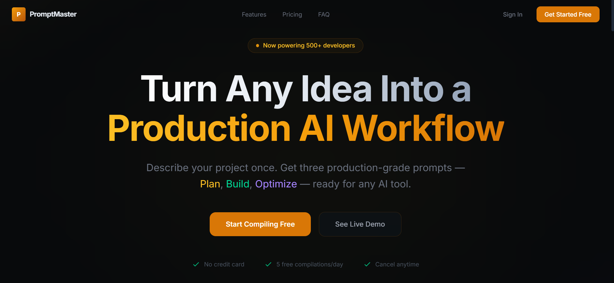

<div align="center">

<br/>

<h1>⌘ PromptMaster</h1>
<p><strong>Turn Any Idea Into a Production AI Workflow</strong></p>

<p>
  
  
  
  
  
</p>

<br/>
</div>

---

## Overview

PromptMaster is an AI-powered tool that transforms any idea into three production-grade prompts — **Plan**, **Build**, **Optimize** — ready for any AI system (Claude, ChatGPT, Cursor, Windsurf, Copilot, Grok, etc).

Describe your project once, get a complete execution workflow instantly.

<br/>

<!-- Landing Page Preview -->

## Landing Page



---

## The Three Stages

| Stage | Focus | Output |
|-------|-------|--------|
| **1 — Planning & Architecture** | Requirements, Tech Stack, DB Design, API Structure, Roadmap | Architecture blueprint |
| **2 — Implementation** | Production code, Frontend/Backend, Validation, Best Practices | Build instructions |
| **3 — Review & Optimization** | Security audit, Edge cases, Performance, Testing, Deployment | Review checklist |

---

## Features

- **One-click compilation** — describe your idea, get 3 prompts in seconds
- **Live streaming** — watch prompts compile in real-time
- **Copy per stage** or **Copy All** with one click
- **Export** as JSON or Markdown (Pro)
- **History** — browse, search, and revisit past compilations
- **Rate limiting** via Upstash Redis
- **Authentication** via Clerk (Google, GitHub, Email)
- **Team workspace** (Teams tier)
- **Dark mode** by default — premium developer aesthetic

---

## Tech Stack

| Layer | Technology |
|-------|-----------|
| Frontend | React 18, Vite 5, Tailwind CSS 4 |
| Backend | Node.js, Express |
| Auth | Clerk |
| Database | Supabase (PostgreSQL) |
| Rate Limiting | Upstash Redis |
| AI | Groq (LLaMA 3.3 70B) |
| Payments | Stripe |
| Email | Resend |

---

## Getting Started

### Prerequisites

- Node.js 18+
- Accounts: Clerk, Supabase, Upstash, Groq

### Setup

```bash
# 1. Clone
git clone https://github.com/Shivangi1515/ProjectArchitect-AI.git
cd prompt-master

# 2. Install dependencies
npm install

# 3. Configure environment
cp .env.example .env
# Fill in your API keys

# 4. Setup database
# Open Supabase SQL Editor → paste schema.sql → Run

# 5. Start server (Terminal 1)
node server/index.js

# 6. Start frontend (Terminal 2)
npm run dev
```

Open **http://localhost:5173** in your browser.

---

## Environment Variables

| Variable | Required | Description |
|----------|----------|-------------|
| `GROQ_API_KEY` | Yes | Groq AI API key |
| `CLERK_SECRET_KEY` | Yes | Clerk secret key |
| `CLERK_PUBLISHABLE_KEY` | Yes | Clerk publishable key |
| `SUPABASE_URL` | Yes | Supabase project URL |
| `SUPABASE_ANON_KEY` | Yes | Supabase anonymous key |
| `SUPABASE_SERVICE_ROLE_KEY` | Yes | Supabase service role key |
| `UPSTASH_REDIS_URL` | Yes | Upstash Redis URL |
| `UPSTASH_REDIS_TOKEN` | Yes | Upstash Redis token |
| `STRIPE_SECRET_KEY` | No | Stripe secret key |
| `RESEND_API_KEY` | No | Resend API key |

---

## Project Structure

```
prompt-master/
├── server/
│   ├── index.js              # Express server entry
│   ├── middleware/            # Auth, rate limit, error handler
│   ├── routes/               # Compile, stripe, webhooks, history, user
│   ├── db/                   # Supabase client
│   └── lib/                  # Redis, Resend
├── src/
│   ├── main.jsx              # React entry with ClerkProvider
│   ├── App.jsx               # Router + Dashboard layout
│   ├── index.css             # Tailwind v4 + custom theme
│   ├── pages/                # Landing, Compile, History, Pricing, Settings
│   └── utils/                # Constants, parsePrompts
├── schema.sql                # Full database schema
├── .env.example              # Environment template
└── requirements.txt          # Tool requirements
```


<br/>
<div align="center">
  <strong>🚩 WORK IN PROGRESS 🚩</strong>
</div>
